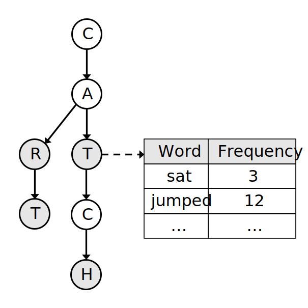

# Markov chain sentence generator
The goal of the project is to create a program that can generate sentences based on an input of text, e.g. a book or book collection. The program is intended to work with texts written in English. First the text is read in, stored into a trie structure with the frequencies of n+1 consecutive words occurring in the text (n being the order of the Markov chain), and then text is generated according to the Markov process. The generated text is processed before displaying it to the user.

## Program structure
There are four classes:**ui**, **service**, **trie** and **node**
- The **ui** class provides a user interface where the user can tell the program to read in some file, determine what the order of the Markov chain should be, and generate text. The **ui** class passes the user’s decisions to the **service** class
- The service class contains the logic for reading in and cleaning the input text, provides an interface to the trie class for storing the data into it and asking it to retrieve words, and post processesing the text.
	- when reading in the data, special characters are handled in a method called `_handle_special_characters`, then the text is tokenized by splitting it up into separate words or parts of words (e.g. don’t --> do + n’t) in the method `tokenize`
	- next the method `create_trie_and_count_frequencies` is used to store the tokenized text into the trie by taking each word and the n consecutive words and storing them into the trie with the frequency at which these n+1 words occur in the source text. If e.g. the order or the Markov chin is n = 2, then for each word we store that word and the 2 following words into the trie. The picture below shows an example of the trie. We do not, however, store the articles “a”, “an”, and “the” into the trie, but instead the word that follows, along with the information that that word had an article before it. Similarly we do not store the punctuations “.,?!” into the trie, but instead for each word the information of whether it preceded or followed by a punctuation.
	- Once the trie is created, the user can use the `generate_text` method. First the trie is asked to give n initial words by invoking its `choose_initial_words` method, after which the Markov process is used to get the next word based on the previous n words by passing the n previous words to the trie through its `get_next_word` method. This will select the next word based the relative frequencies of all the words that follow the n first words. The picture below shows this in more detail.
	- Before displaying the text to the end user, the method `post_process` is used. This will first check for each two consecutive words if there was a punctuation “.,?!” after the first word and before the second one. If there was, we add that punctuation between these two words. Then we check which words had an article “a”, “an”, or “the” in front of it and add it there as well. Finally we capitalize the first words of each sentence and concatenate tokenized words such as do + n’t --> don’t.
- The **trie** class has a root node under which child nodes are placed. The trie manages the chains of nodes by adding new nodes to the trie, traverses a chain of nodes according to a list of words that are given, chooses randomly n consecutive words for the service class to start the Markov process, and tells the last node of a list of words to select a child according to their relative frequencies
- The **node** class contains a dictionary of words that follow it with their corresponding nodes as values in the dictionary. The node also keeps track of how often it has occurred in the source text, articles that came before it, and punctuations that came immediately before or after it. Most importantly, it can select a child node based on the relative frequencies of its children.

## Performance
A more detailed explanation of how the program performs in reality is discussed in the [testing report](./ testing_report.md). Generally though the program performs as you would expect: larger input files are able to generate more diverse text instead of closely repeating the source file, and raising the order of the Markov chain gives more coherent text, but also more closely follows the source text.

Since the data is stored into a trie structure, the worst-case time complexity is O(w) where w is the amount of words in the source text. This would basically mean that every word in the source text is a different word and the frequency of each consecutive n+1 words is 1, which would realistically never happen unless the source text is extremely short, or a vocabulary. In either case, the generated text would simply repeat the source text, so we would not generate any interesting text anyway. The worst-case space complexity is likewise O(w(n+1)) where n is the order of the Markov chain. Again, this worst-case complexity is only reached if each word in the source text is unique.

## Possible improvements
I tried doing part of speech tagging (tagging words as verb, noun, etc.) when reading the text in and having the program try to select words based on sentence structures present in the text, but that was problematic as discussed in the weekly reports. Also creating the trie from parts of speech instead of the actual words was ineffectual. It seems that to improve the quality of the text, it is best to maybe use these in the post processing phase. With more time, however, it may be possible to use stemming or lemmatization and put the base forms of the words into the trie, then generate the text and have some logic transform the selected words into forms that make the sentence structure more valid. This, I suspect, would require a significant amount of work.

## Sources
- Trie structures:
	- [https://www.geeksforgeeks.org/trie-insert-and-search/](https://www.geeksforgeeks.org/trie-insert-and-search/)
	- [https://iq.opengenus.org/time-complexity-of-trie/](https://iq.opengenus.org/time-complexity-of-trie/)
	- [https://en.wikipedia.org/wiki/Radix_tree](https://en.wikipedia.org/wiki/Radix_tree)
	- [https://en.wikipedia.org/wiki/Trie](https://en.wikipedia.org/wiki/Trie)

- Markov chains:
	- [https://brilliant.org/wiki/markov-chains/](https://brilliant.org/wiki/markov-chains/)
	- [https://towardsdatascience.com/markov-and-hidden-markov-model-3eec42298d75]( https://towardsdatascience.com/markov-and-hidden-markov-model-3eec42298d75)
	- [https://en.wikipedia.org/wiki/Hidden_Markov_model]( https://en.wikipedia.org/wiki/Hidden_Markov_model)
	- [https://en.wikipedia.org/wiki/Markov_chain]( https://en.wikipedia.org/wiki/Markov_chain)
