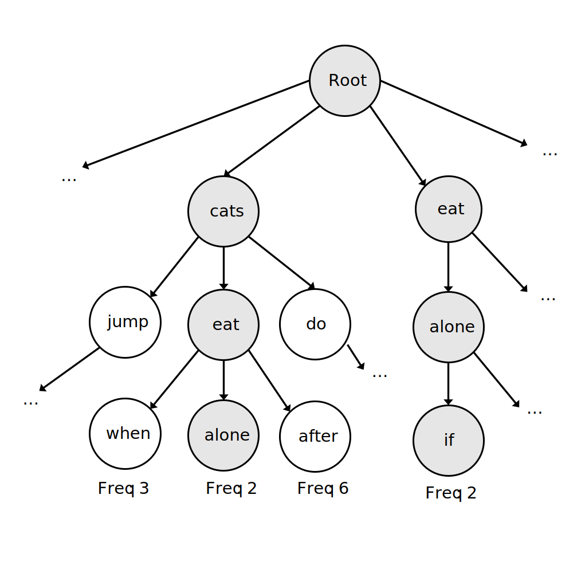

# Markov chain sentence generator
The goal of the project is to create a program that can generate sentences based on an input of text, e.g. one or more books, poems, articles, musical lyrics, etc. Presumably the program will generate sentences in a similar style to the given input text.

## Algorithm design
Sentences are generated by drawing words according to probabilities based on previous ones through Markov chains. The probabilities of subsequent words following a given word, word couple, triple, etc. are stored in a trie structure. The trie structure has a worst-case time complexity of O(n) where n is the length of the longest word (or word pair, triple, etc.) in the input text. The space complexity is O(ALPHABET_SIZE * average key length * N) where N is the number of keys in the trie.

Because text can include all sorts of symbols and numbers in addition to alphabets (e.g. ?!{]$, etc.) we need to determine how to handle these. I will probably exclude these in the first version of the program, though there would be a benefit to having them so that the program can end sentences (in ".", "?", or "!").

I think that in order to have these extra symbols we will first need to read through the source document to find out all the different symbols it contains. These could be stored into a set. The size of the set could then determine how many children the nodes in the trie should have.

## Input and output
The input is a text file with the text on which the sentence generation will be done, e.g. some book as a text file. The output will be text generated by following the Markov chain.

## Other information
- The project will be done with Python
- I can also evaluate a project done with Java
- Documentation will be in English
- Study program: Tietojenkäsittelytieteen kandidaatti (TKT)

## Sources
- Trie structures:
	- [https://www.geeksforgeeks.org/trie-insert-and-search/](https://www.geeksforgeeks.org/trie-insert-and-search/)
	- [https://iq.opengenus.org/time-complexity-of-trie/](https://iq.opengenus.org/time-complexity-of-trie/)
	- [https://en.wikipedia.org/wiki/Radix_tree]( https://en.wikipedia.org/wiki/Radix_tree)
	- [https://en.wikipedia.org/wiki/Trie]( https://en.wikipedia.org/wiki/Trie)

- Markov chains:
	- [https://brilliant.org/wiki/markov-chains/](https://brilliant.org/wiki/markov-chains/)
	- [https://towardsdatascience.com/markov-and-hidden-markov-model-3eec42298d75]( https://towardsdatascience.com/markov-and-hidden-markov-model-3eec42298d75)
	- [https://en.wikipedia.org/wiki/Hidden_Markov_model]( https://en.wikipedia.org/wiki/Hidden_Markov_model)
	- [https://en.wikipedia.org/wiki/Markov_chain]( https://en.wikipedia.org/wiki/Markov_chain)

- Part of speech tagging:
	- [https://towardsdatascience.com/part-of-speech-tagging-for-beginners-3a0754b2ebba]( https://towardsdatascience.com/part-of-speech-tagging-for-beginners-3a0754b2ebba)
	- [https://en.wikipedia.org/wiki/Viterbi_algorithm]( https://en.wikipedia.org/wiki/Viterbi_algorithm)
