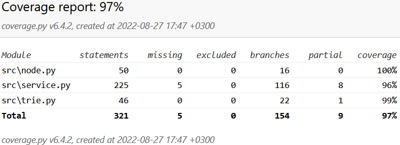

# Testing report
This document details the results of testing the program

## Unit testing
Unit testing is done with automated tests using Pytest ([Unit test coverage report](https://jonathanheyno.github.io/tiramarkovchaincodecov/index.html)). The overall test coverage is currently 97%
Classes service, trie and node are tested, the code for the ui and index.py file are not. The unit tests test that the basic functions of these classes work.

If you want to run the tests locally:
1) install the dependencies in [requirements_dev.txt](../requirements_dev.txt) with `pip install -r requirements_dev.txt`
2) to get the test coverage, run `pytest src`, then run `coverage report -m` in the project root folder
2) if instead you want a html version of the coverage report:
	- run command `coverage run --branch -m pytest src`
	- then run `coverage html`. The report will be created into the folder `htmlcov`

## Manual testing

The program is tested manually by evaluating the quality and grammatical structure of the generated text. We do this testing based on the texts
in the file 'sherlock_holmes.txt'. This file contains all the Sherlock Holmes stories and has over 650.000 words. This file is chosen for examining the text quality,
since the stories are written in modern English, as oppose to e.g. the texts in the file 'shakespeare.txt' which are written in old Victorian
English, or the archaic texts in the Bible. The quality of the generated text of course depends on the source file, but studying this file can
give a reasonable understanding of the functioning of the program.

The results are in line with expectations. The quality of the text is directly related to the order of the Markov chain. Increasing the order of the Markov chain results
in better quality text, but also in more closely repeating the source data.

A larger input file also results in more unique sentences. Shorter texts, such as collections of poems or song lyrics do better with a
lower order for the Markov chain since otherwise the risk of simply repeating the source data grows, but of course text quality suffers.

The table below shows the results of analyzing the text generated from the file 'sherlock_holmes.txt' when running the text generation with a Markov chain of order 3 and order 2.
The table shows how many sentences were analyzed, the amount of words in these sentences, how many grammatical errors were found in them,
and from how many different places from the source file the program pieced the text together. This gives an idea of
how closely the generated text repeats the source data. For instance, when running the text generation with an order of 3, one sentence that was generated was this:

"The first fellow was **a bit too** good for our people."

The program generated this sentence by combining the following two sentences. The part that is in bold (**a bit too**) shows where these two sentences were joined together

"The first fellow was **a bit too** active, but the second was…"

+

"…this gentleman upon the sofa was **a bit too** good for our people."

A longer piece of generated text looks like this. The parts where different sentences from the source data are joined together are in bold as above.
The gramatical structure seems to be quite logical and the text seems to make sense quite well.

The first fellow was **a bit too** good for our people. **He was in** the loft? Well, surely his own wife **ought to know**   **by this time** 
**even the policemen** and stokers, who had a very vague **idea of what had** occurred. **We have only** their word for that. 

| Markov chain order | Sentences| Words | Grammatical errors | Source text locations |
|            :---:   | :---:    | :---: | :---:              | :---:                 |
| 2                  | 7        | 188   |  13                |  84                   |
| 3                  | 7        | 120   |  0                 |  18                   |

When reducing the order of the Markov chain to two, the sentence structure of the generated text has more gramatical problems.
As evidenced in the above table, it also has text picked from more locations from the source file, as you would expect. Looking at 
the amount of words and sentences, there seem to be more words per sentance than when using an order of 3 for the Markov chain.
Taking all this together makes sense: the sentences are longer since they are more meandering, have more grammatical errors, and make 
less sense since more and shorter bits of text are concatenated together. This is evident also by just looking at an example of the 
generated text below. It is much less sensical than in the previous case.

I will still call her, had **hurried up** with a **pipe for** **example**, **there was** **no** sheepdog. 
**You say** **that the** **symbols** **picture** picture **of three** is gilchrist, a fine scholar and athlete plays 
in the rugby team and the cricket team for the **college, and** **it** **was** **a bitterly cold** **and** **melancholy** 
**we were** **each** **in turn** **to** **the country** **and** **we** **shall** investigate the **cause of** 
**my** **father** **came** **back** **to** 
**prevent** **you** **from** the other **side of** **his** ducal history.

## Code quality
Code quality in this project is measured with Pylint according to the definitions in the file [.pylintrc](../.pylintrc). The score for code quality is currently 9.78.

To run the Pylint check locally:
1) install the dependencies in [requirements_dev.txt](../requirements_dev.txt) with `pip install -r requirements_dev.txt`
2) run the command `pylint src` in the project root folder
